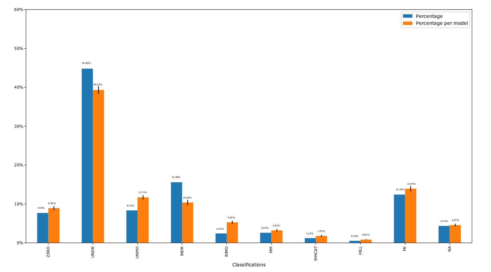
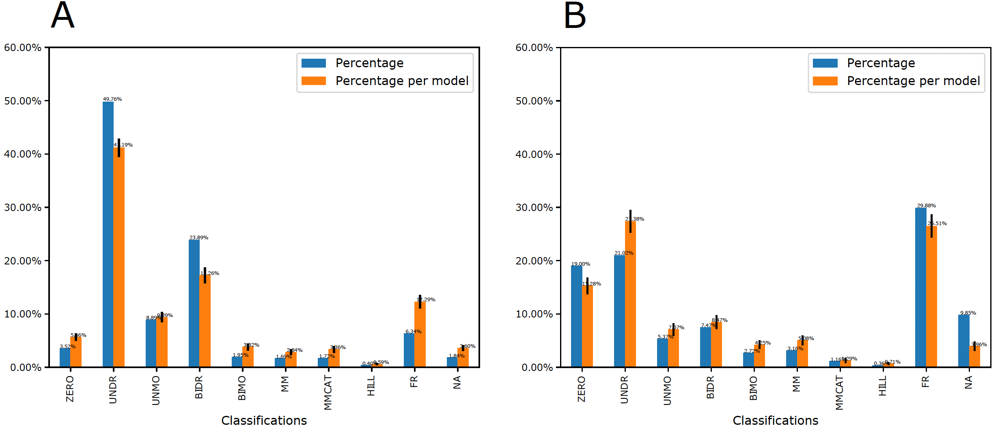

.. _Examples:
 

Examples
=============

1) Kinetics type distribution from curated BioModels Database. The blue bars investigate 
the kinetics type distribution on the average of all the reactions from all the models. 
The orange bars indicate the distribution on the average of reactions for each model. The 
trend for two color bars is qualitatively similar. The error bars on the top of orange bars 
represent the uncertainty among different models. 

Based on the result of Figure 1 from curated BioModels, users can select UNDR with the 
highest probability as the general kinetics of mass action to model synthetic reaction 
networks. Users can also follow its distribution to assign the probability for each type of 
kinetics while generating random synthetic reaction networks. In detail, users can assign the 
probability values of generating reaction networks from the certain kinetics of ZERO, UNDR, 
UNMO etc. 

2) Kinetic law type distribution for signaling networks (A) and metabolic networks (B) from 
BioModels Database. The blue bars investigate the kinetics type distribution on the 
average of all the reactions from all the models. The orange bars indicate the distribution 
on the average of reactions for each model. The trend for two color bars is qualitatively 
similar for each subplot. However, there is a significant difference of the kinetics type 
distributions between the signaling and metabolic networks. The error bars on the top of 
orange bars represent the uncertainty among different models.

If users want to model synthetic signaling networks instead of metabolic networks, they can 
refer to the distributions of Figure A instead of Figure B.